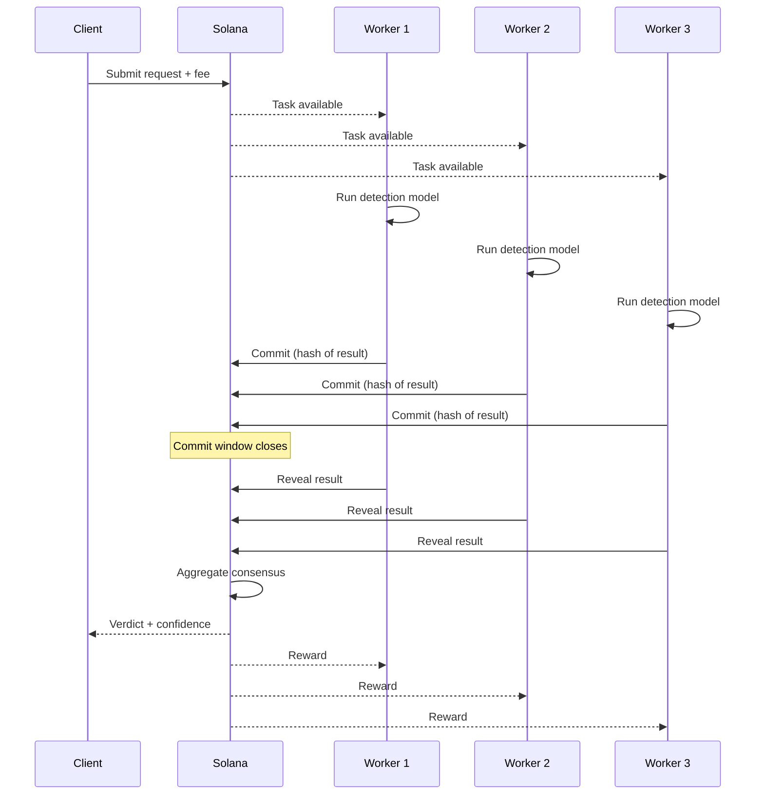
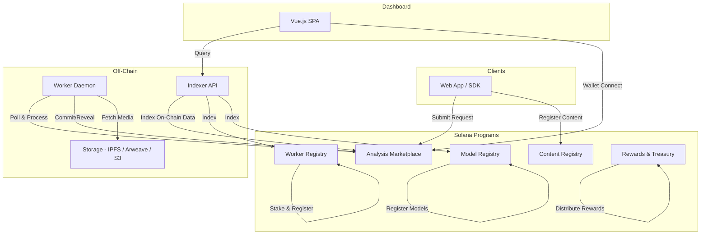

<p align="center">
  
</p>

<h1 align="center">DFPN</h1>
<h3 align="center">The Decentralized Immune System Against Synthetic Media</h3>

<p align="center">
  <a href="https://solana.com"></a>
  <a href="https://www.anchor-lang.com"></a>
  <a href="https://www.rust-lang.org"></a>
  <a href="LICENSE"></a>
</p>
<p align="center">
  <a href="https://vuejs.org"></a>
  <a href="https://www.typescriptlang.org"></a>
  <a href="https://pytorch.org"></a>
  <a href="https://dfpn.cryptuon.com"></a>
</p>

<br/>

> **DFPN is a decentralized coordination layer for deepfake detection on Solana.** It connects clients who need media verified with independent node operators running their own detection models and GPU infrastructure. Economic incentives -- staking, rewards, and slashing -- ensure honest, accurate results without any central authority.

<br/>

<table>
<tr>
<td align="center" width="33%">
<h4>Trustless Verification</h4>
<p>Multiple independent workers analyze every request. Commit-reveal protocol prevents collusion. Results are aggregated into consensus verdicts on-chain.</p>
</td>
<td align="center" width="33%">
<h4>Economic Security</h4>
<p>Workers stake DFPN tokens as commitment. Accurate work earns rewards. Fraud gets slashed. The protocol aligns incentives without trusting anyone.</p>
</td>
<td align="center" width="33%">
<h4>Open & Composable</h4>
<p>Bring your own models. Bring your own GPUs. The protocol is the coordination layer -- detection capabilities are permissionlessly provided by operators.</p>
</td>
</tr>
</table>

---

## The Problem

AI-generated synthetic media is growing exponentially. Face swaps, voice clones, generated images, and manipulated videos erode trust in digital content. Centralized detection services create single points of failure, lack transparency, and concentrate power over what is deemed "real."

**DFPN decentralizes the solution.** Independent operators run diverse detection models. Economic incentives replace trust. On-chain transparency replaces black boxes.

---

## How It Works



**9 steps. Fully on-chain. Trustless end-to-end.**

1. **Submit** -- Client posts media hash + fee + required modalities
2. **Route** -- Workers poll for matching requests
3. **Analyze** -- Each worker runs their models locally (DFPN never sees inference)
4. **Commit** -- Workers lock in result hashes (prevents copying)
5. **Reveal** -- Results are disclosed and verified against commitments
6. **Consensus** -- Reputation-weighted aggregation produces a verdict
7. **Reward** -- Workers and model developers earn based on accuracy

---

## Participate

<table>
<tr>
<td width="33%">

### Run a Node

**For GPU operators and infrastructure providers**

Stake DFPN tokens, run detection models on your hardware, and earn rewards for every request you process accurately.

- Min stake: **5,000 DFPN**
- Hardware: RTX 3080+ GPU
- Earn: **65% of request fees**

[Get started as a Worker &rarr;](documentation/docs/getting-started/workers.md)

</td>
<td width="33%">

### Verify Media

**For platforms, newsrooms, and applications**

Submit images, videos, or audio for deepfake analysis. Get consensus verdicts from multiple independent workers with full audit trails.

- SDK: TypeScript & Python
- Cost: **~0.002-0.008 SOL** per request
- Speed: **1-30 seconds**

[Get started as a Client &rarr;](documentation/docs/getting-started/clients.md)

</td>
<td width="33%">

### Build Models

**For ML researchers and algorithm developers**

Register your detection models on the network. Every time a worker uses your model to process a request, you earn a share of the fee.

- Stake: **20,000 DFPN** per model
- Earn: **20% of request fees**
- Supported: Image, Video, Audio, Face, Voice

[Get started as a Model Developer &rarr;](documentation/docs/getting-started/model-developers.md)

</td>
</tr>
</table>

---

## Detection Models

Four pre-configured models ship with the worker client, covering the major deepfake modalities:

| Model | Modality | Architecture | Accuracy | GPU Speed |
|:------|:---------|:-------------|:--------:|:---------:|
| **face-forensics** | Face Manipulation | SBI / EfficientNet-B4 | 97.2% | 50ms |
| **universal-fake-detect** | AI-Generated Images | CLIP-ViT-L/14 | 99.8% | 100ms |
| **video-ftcn** | Video Authenticity | Xception + Temporal CNN | 96.4% | 2s |
| **ssl-antispoofing** | Voice Cloning | wav2vec 2.0 / XLSR-53 | 99.2% | 200ms |

Workers can run any combination of models. Model developers can register new models permissionlessly.

---

## Token Economics

<table>
<tr>
<td width="50%">

**Total Supply:** 1,000,000,000 DFPN

| Allocation | Share |
|:-----------|:-----:|
| Network Rewards | 38% |
| Treasury | 20% |
| Team & Advisors | 18% |
| Ecosystem Growth | 12% |
| Strategic Partners | 7% |
| Liquidity | 5% |

</td>
<td width="50%">

**Fee Distribution per Request**

```
Workers           ██████████████████████████  65%
Model Developers  ████████                    20%
Treasury          ████                        10%
Insurance Pool    ██                           5%
```

**Scoring:** Accuracy (50%) + Availability (25%) + Latency (15%) + Consistency (10%)

</td>
</tr>
</table>

---

## Architecture



---

## Repository Structure

```
programs/               Solana smart contracts (Anchor)
  content-registry/     Media hash and provenance storage
  analysis-marketplace/ Request creation and result tracking
  model-registry/       Model metadata and versioning
  worker-registry/      Worker staking and reputation
  rewards/              Reward distribution and treasury
worker/                 Node operator client (Rust)
indexer/                REST API indexer (Axum + Tantivy)
sdk/                    TypeScript SDK
models/                 Pre-configured detection models
dashboard/              Vue.js web dashboard
documentation/          MkDocs user documentation
```

## Quick Start

```bash
# Run the dashboard locally
cd dashboard && npm install && npm run dev

# Run a worker node
./scripts/setup-models.sh
cargo run --release -p dfpn-worker -- --config config.yaml

# Build documentation
cd documentation && mkdocs serve
```

## Documentation

Full documentation is available at [dfpn.cryptuon.com](https://dfpn.cryptuon.com) and in the [`documentation/`](documentation/) directory:

- [Getting Started](documentation/docs/getting-started/index.md) -- Setup guides for workers, clients, and model developers
- [How It Works](documentation/docs/concepts/how-it-works.md) -- Request lifecycle, commit-reveal, consensus
- [Tokenomics](documentation/docs/concepts/tokenomics.md) -- Supply, emissions, staking, rewards, slashing
- [API Reference](documentation/docs/reference/api.md) -- REST API endpoints and response formats
- [FAQ](documentation/docs/community/faq.md) -- Common questions answered

## Technology

| Layer | Stack |
|:------|:------|
| Blockchain | Solana, Anchor 0.30.1, SPL Token |
| Worker | Rust, Tokio, Clap |
| Indexer | Rust, Axum, Tantivy |
| Dashboard | Vue 3, TypeScript, Tailwind CSS 4, Chart.js |
| SDK | TypeScript, @solana/web3.js |
| Detection | Python, PyTorch, CLIP, wav2vec 2.0 |

---

<p align="center">
  <b>DFPN</b> -- Trust, but verify. At scale.<br/>
  <a href="LICENSE">MIT License</a>
</p>
