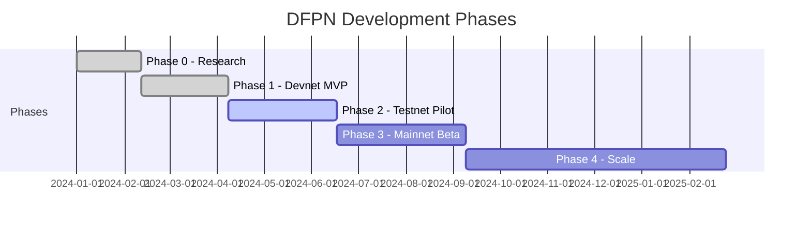

# Roadmap

DFPN development is organized into five phases, from initial research through mainnet launch and ecosystem growth.

---

## Phase 0: Research & Foundations

**Duration:** 4--6 weeks | **Status:** :material-check-circle:{ .green } Completed

Laid the groundwork for the protocol by defining the threat landscape, curating evaluation data, and establishing benchmarks.

- [x] Threat model and adversary taxonomy for deepfake attacks
- [x] Curated evaluation datasets (FaceForensics++, Celeb-DF, ASVspoof, ProGAN)
- [x] Evaluation harness for reproducible model benchmarking
- [x] Baseline accuracy and latency benchmarks for all four detection models
- [x] Protocol design document and economic modeling

---

## Phase 1: Devnet MVP

**Duration:** 6--8 weeks | **Status:** :material-check-circle:{ .green } Completed

Delivered a working end-to-end prototype on Solana devnet, covering the core on-chain programs and a reference worker node.

- [x] Content Registry program -- media hash and provenance storage
- [x] Analysis Marketplace program -- request creation, commit-reveal result flow
- [x] Model Registry program -- model metadata and versioning
- [x] Rewards program -- fee distribution and treasury
- [x] Reference worker client (Rust) with four pre-configured detection models
- [x] Commit-reveal protocol to prevent result copying
- [x] TypeScript SDK for client integration
- [x] CLI tooling for request submission and result querying

---

## Phase 2: Testnet Pilot

**Duration:** 8--10 weeks | **Status:** :material-progress-clock:{ .yellow } In Progress

Hardening the network with staking, reputation, and operational tooling ahead of a public pilot.

- [x] Worker Registry program -- operator staking and management
- [x] Stake-based worker registration with bonding/unbonding
- [ ] Epoch-based scoring (accuracy, availability, latency, consistency)
- [ ] Model versioning and deprecation workflow
- [x] REST API indexer (Axum + Tantivy full-text search)
- [x] Vue.js dashboard with real-time network monitoring
- [ ] Load testing and benchmarking under sustained traffic
- [ ] Dispute resolution flow end-to-end testing
- [ ] Documentation site (MkDocs Material)

---

## Phase 3: Mainnet Beta

**Duration:** 8--12 weeks | **Status:** :material-clock-outline: Upcoming

Production deployment with token economics, governance, and third-party security review.

- [ ] SPL token deployment and treasury initialization
- [ ] Governance integration via Realms DAO
- [ ] Independent security audit of all on-chain programs
- [ ] Mainnet program deployment with upgrade authority multisig
- [ ] Public beta launch with onboarding for initial worker operators
- [ ] Bug bounty program

---

## Phase 4: Scale & Ecosystem

**Duration:** Ongoing | **Status:** :material-clock-outline: Upcoming

Expanding capabilities, reducing friction, and building partnerships.

- [ ] Model marketplace -- third-party developers publish and monetize detection models
- [ ] Advanced storage integration (Arweave, IPFS, Shadow Drive)
- [ ] Specialized detection modules (document forgery, satellite imagery, medical imaging)
- [ ] Platform partnerships for automated content verification
- [ ] Mobile SDK for on-device pre-screening
- [ ] Cross-chain verification bridges

---

## Timeline Summary

