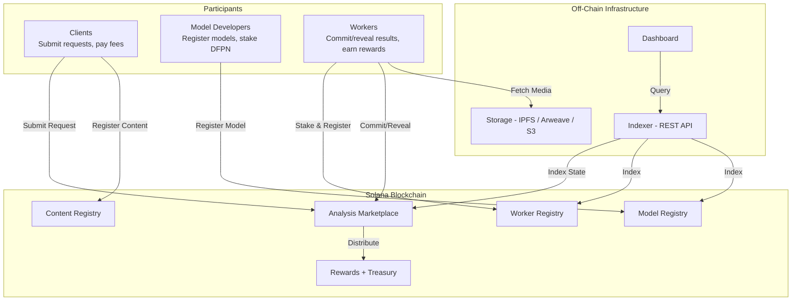
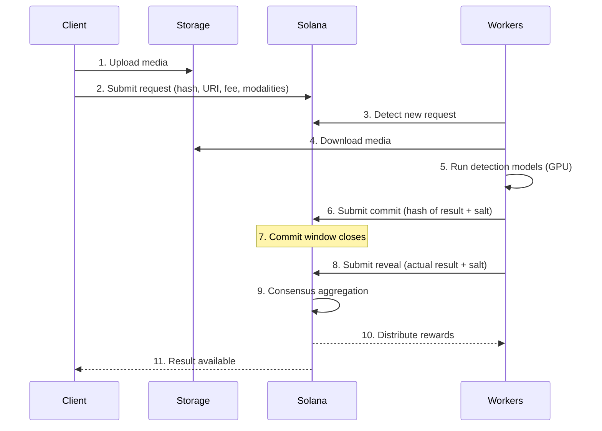

# System Architecture

DFPN is a coordination layer, not a detection engine. It connects clients, workers, and models through on-chain programs and off-chain infrastructure. This page explains how the pieces fit together.

---

## High-Level Overview

---

## On-Chain Components

DFPN uses five Solana programs (smart contracts) built with the Anchor framework. Each handles a specific domain.

### 1. Content Registry

Stores content hashes and provenance data. When media is submitted for analysis, its SHA-256 hash is registered here along with an optional storage URI and creator attestation.

**Key accounts:** `ContentAccount`, provenance claims

**Purpose:** Establish an immutable record of what was analyzed.

### 2. Analysis Marketplace

The core coordination program. Manages the full lifecycle of analysis requests: creation, worker assignment, commit-reveal phases, consensus aggregation, and finalization.

**Key accounts:** `AnalysisRequest`, `ResultCommit`, `ResultReveal`

**Purpose:** Route requests to workers, enforce the commit-reveal protocol, aggregate results.

### 3. Model Registry

Tracks detection model metadata, versions, benchmark scores, and activation status. Model developers register here. Workers reference this registry to declare which models they run.

**Key accounts:** `ModelAccount`

**Purpose:** Catalog available models and track their performance.

### 4. Worker Registry

Manages worker registration, staking, reputation scores, and modality declarations. Workers must register and stake DFPN before they can accept tasks.

**Key accounts:** `WorkerAccount`

**Purpose:** Track worker identity, stake, reputation, and capabilities.

### 5. Rewards + Treasury

Handles epoch-based reward distribution, fee splitting, treasury management, and the insurance pool. Calculates worker and model developer payouts based on performance scores.

**Key accounts:** `EpochStats`, treasury token account, insurance pool

**Purpose:** Distribute fees and rewards fairly based on measured contributions.

---

## Off-Chain Components

### Worker Daemon

The worker daemon is a long-running process that:

- Polls the indexer or on-chain state for new requests matching its capabilities
- Downloads media from the client's storage URI
- Runs detection models locally (via Python subprocess, Docker, or HTTP microservice)
- Submits commit and reveal transactions to Solana
- Reports health and metrics

Workers run the daemon on their own infrastructure. DFPN never touches the inference process.

### Indexer

The indexer is a service that mirrors on-chain state into a queryable REST API. It provides:

- Fast lookups for requests, results, workers, and models
- Real-time event subscriptions
- Aggregated statistics and leaderboards

The indexer is a convenience layer. All authoritative data lives on-chain, and clients can bypass the indexer entirely by reading Solana accounts directly.

### Off-Chain Storage

Media files are stored off-chain. DFPN only records the content hash and storage URI on-chain. Supported storage backends:

| Storage | Tradeoffs |
|---------|-----------|
| **IPFS** | Decentralized, content-addressed, requires pinning |
| **Arweave** | Permanent storage, higher upfront cost |
| **S3 / GCS / R2** | Fast, reliable, centralized |
| **HTTP** | Simple, any web server works |

Clients choose where to host their media. Workers download from whatever URI is provided.

---

## Data Flow

Here is the full data flow for a single analysis request:

---

## What DFPN Controls vs. What Operators Control

This separation of concerns is fundamental to DFPN's design.

| DFPN Controls | Operators Control |
|---------------|-------------------|
| Request routing and matching | Hardware and infrastructure |
| Commit-reveal protocol | Model selection and deployment |
| Consensus aggregation | Inference execution |
| Reputation scoring | Which requests to accept |
| Reward distribution | Scaling and capacity planning |
| Slashing enforcement | Software updates and maintenance |
| Model benchmarking | Model training and improvement |

DFPN is deliberately minimal in what it controls. The protocol coordinates and incentivizes, but all detection work happens on infrastructure owned and operated by independent participants.

---

## Design Principles

### Minimize On-Chain State

Solana accounts are expensive. DFPN stores only hashes, scores, and minimal metadata on-chain. Media files, detailed results, and model weights all live off-chain.

### Operator Independence

Workers and model developers make their own decisions about hardware, models, and capacity. The protocol does not dictate which GPU to buy or which framework to use. This enables a diverse ecosystem where participants compete on quality and cost.

### Economic Alignment

Every protocol rule is backed by economic incentives. Workers earn more by being accurate and available. Model developers earn more when their models perform well. Bad behavior costs real tokens through slashing. This alignment means the protocol does not need a central authority to enforce quality.
